# AOCR

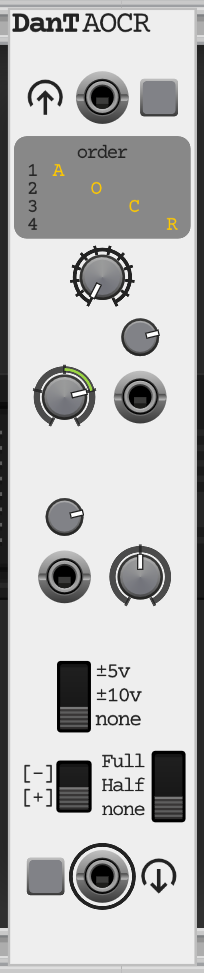

`AOCR` (Attenuvert, Offset, Clip, Rectify) is a versatile signal processing module, allowing you to manipulate `audio` and `CV signals` in various ways. It features flexible `signal attenuversion`, `offset`, `clipping`, and `rectification`, with a unique ability to reorder the `processing chain`.

## Controls and Ports

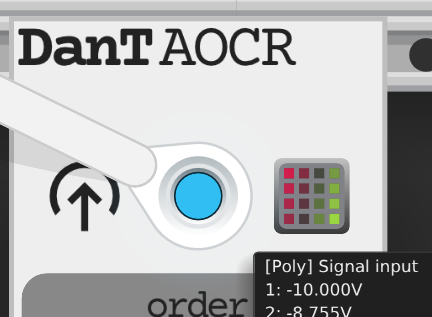

### Signal Input

* **`[Poly] Signal input`**: `Polyphonic input` for the `signal` to be processed. `Normal signal levels` in `VCV Rack` are typically `±10V`. The `module` is designed to accept `signals` within this `range`.

* **Input Grid Light**: A visual indicator of the incoming `signal's voltage` and `polyphonic channels`. The brightness of individual lights corresponds to the strength of the `signal`. `Negative signals` are indicated by `red` lights, while `positive signals` are indicated by `green` lights.

### Operation Order

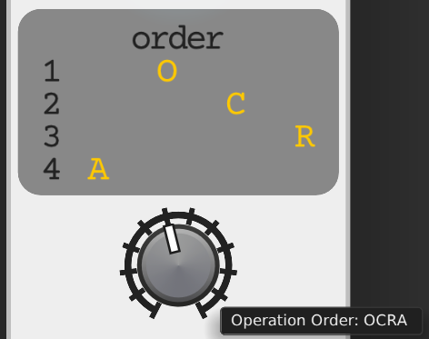

* **`Operation Order` Knob**: This `knob` selects the order in which the four main `operations` (`Attenuvert`, `Offset`, `Clip`, `Rectify`) are applied to the `signal`. There are `12` possible permutations. The display above the `knob` shows the current order as a sequence of `A`, `O`, `C`, `R` characters.

### Attenuverter

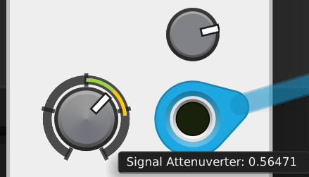

* **`Signal Attenuverter` Knob**: `Attenuverts` the `input signal` from `-2x` to `+2x`. The `knob` features an `arc` around it that visually represents the `attenuversion amount`. The `portion` of the `arc` controlled by the `knob's physical position` is shown in `green` (or `red` for `negative values`), while the `portion` added by the `CV input` is shown in `yellow`.

* **`Attenuverter CV input`**: `CV input` for controlling the `attenuverter amount`. This `input` has a `1:1` ratio, meaning an input of `+1v` will add `1x` to the attenuverter parameter value. The incoming `CV` is multiplied by the `Attenuverter CV attenuverter Trimpot` setting, and the result is added to the `Signal Attenuverter knob's value`.

* **`Attenuverter CV attenuverter` Trimpot**: `Attenuverter` for the `Attenuverter CV input`, from `-2x` to `+2x`.

### Offset

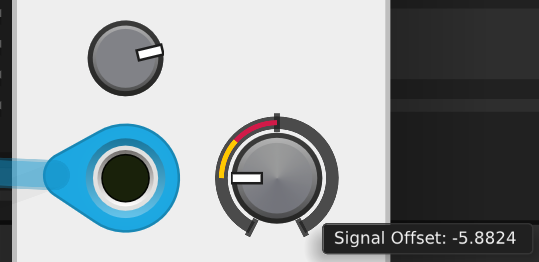

* **`Signal Offset` Knob**: Adds a `DC offset` to the `signal`, from `-10V` to `+10V`. The `knob` features an `arc` around it that visually represents the `offset amount`. The `portion` of the `arc` controlled by the `knob's physical position` is shown in `green` (or `red` for `negative values`), while the `portion` added by the `CV input` is shown in `yellow`.

* **`Offset CV input`**: `CV input` for controlling the `offset amount`. This `input` has a `1:1` ratio, meaning an input of `+1v` will add `1x` to the offset parameter value. The incoming `CV` is multiplied by the `Offset CV attenuverter` setting, and the result is added to the `Signal Offset knob's value`.

* **`Offset CV attenuverter` Trimpot**: `Attenuverter` for the `Offset CV input`, from `-2x` to `+2x`.

### Clipping

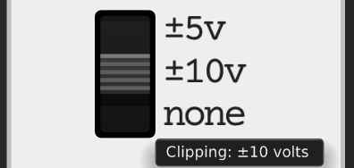

* **`Clipping` Switch**: Selects the `clipping level`.
* **None**: No `clipping` applied.
* **±10v**: Clips the `signal` at `-10V` and `+10V`.
* **±5v**: Clips the `signal` at `-5V` and `+5V`.

### Rectification

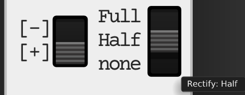

* **`Rectify` Switch** (`Switch`): Selects the `rectification type`.
* **None**: No `rectification` applied.
* **Half**: `Half-wave rectification`.
* **Full**: `Full-wave rectification`.

* **`Rectify direction` Switch**: Selects the direction of `rectification` when `rectification` is active, for `half-wave`, `negative values` are `zeroed`; for `full-wave`, `negative values` are `inverted`
* **[+]**: `Positive rectification`
* **[-]**: `Negative rectification`

### Signal Output

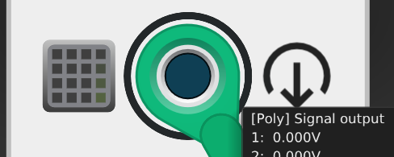

* **`[Poly] Signal output`**: `Polyphonic output` for the processed `signal`. The `output voltage` is the result of the `input signal` passing through the `attenuverter`, `offset`, `clipping`, and `rectification stages`, in the order specified by the `Operation Order knob`.

* **Output Grid Light**: A visual indicator of the outgoing `signal's voltage` and `polyphonic channels`.

## Usage

`AOCR` can be used for a wide range of `signal manipulations`:

* **Wave Shaping**: Combine `attenuversion`, `offset`, `clipping`, and `rectification` to create complex `wave shapes` from simple `waveforms`.

* **CV Processing**: Scale, shift, and `clip CV signals` to fit specific `ranges` or create new `modulation sources`.

* **Audio Effects**: Introduce `distortion`, `foldback`, or unique `timbres` by applying aggressive `clipping` and `rectification`. Be aware that aggressive `signal processing` can introduce `aliasing artefacts`, especially with `high-frequency content`.

* **Creative Routing**: Experiment with the "`Operation Order`" `knob` to discover unexpected and interesting `sonic transformations`. The `order of operations` can drastically change the final `output`.

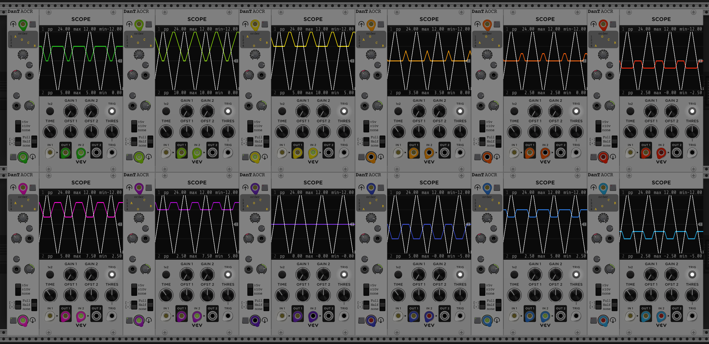

### Suggested Module Settings

Here are a few examples of how to use `AOCR` for common `signal processing` tasks:

* **Simple Attenuation/Amplification**:
  * Goal: Adjust the overall level of an `audio` or `CV signal`.
  * `Operation Order`: `AOCR` (or any order where `A` is first if you want to apply `attenuversion` before other effects).
  * `Signal Attenuverter`: Adjust to desired `attenuation` (e.g., `0.5x` for `half volume`) or `amplification` (e.g., `1.5x`).

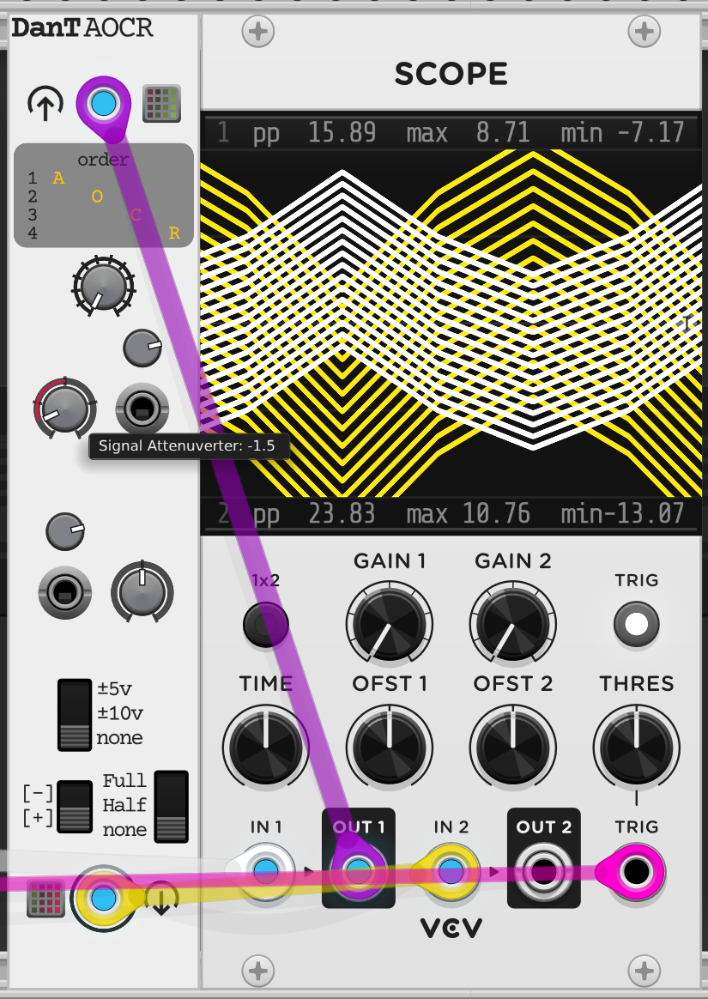

* **Centring a Bipolar `CV` to Unipolar**:
  * Goal: Convert a `±5V` `LFO` to a `0V` to `10V` `unipolar signal`.
  * `Operation Order`: `OACR` (Offset then Attenuvert, Clip, Rectify).
  * `Signal Attenuverter`: `1.0x`.
  * `Signal Offset`: `+5V`.
  * `Clipping`: `±10v` (to ensure it doesn't exceed `10V` if the input is slightly off).
  * Result: A `±5V` `signal` (`10V` peak-to-peak) shifted up by `5V` will range from `0V` to `10V`.

* **Aggressive Wave Folding/Distortion**:
  * Goal: Create harsh, `distorted timbres` from a `sine wave`.
  * `Operation Order`: Experiment with `ACRO` or `OCRA`.
  * `Signal Attenuverter`: `2.0x` (to push the `signal` beyond `clipping limits`).
  * `Signal Offset`: Adjust slightly (`±1V` to `±3V`) to shift the `waveform` into different `clipping regions`.
  * `Clipping`: `±5v` (for more aggressive `clipping`).
  * `Rectify`: `Full` or `Half`, experiment with `Rectify direction` `[+]` or `[-]`.
  * Result: Introduces significant `harmonics` and `non-linearities`. Listen for `aliasing artefacts` and adjust `input signal frequency` if needed.

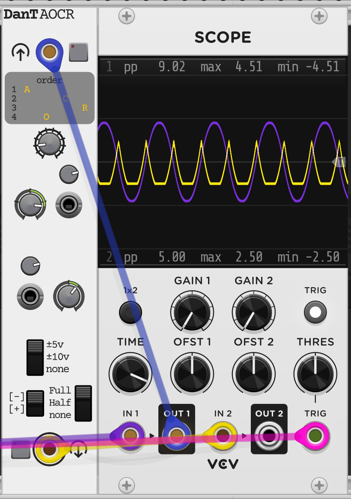

## Technical Specifications

* **Width**: `5HP`
* **Channels**: `Polyphonic`
* **Bypass**: Yes (`Signal Input` to `Signal Output`)
