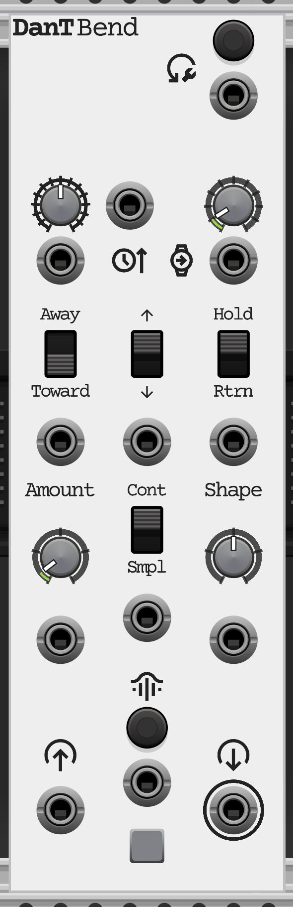

# Bend

`Bend` is a polyphonic CV processor that produces programmable portamento, glides, envelopes, and pitch bends based on
incoming trigger signals. It acts as an articulate translation layer for `V/Oct signals` by smoothly bending their
pitch.

## Controls and Ports

### Signal Input and Output

* **`[Poly] V/Oct Signals` Input**: Polyphonic input for the base pitch signals. Normal `V/Oct` signals are expected
  (typically spanning Octave 0 to 8, mapped as `-4V` to `+4V` with `0V` at C4).
* **`[Poly] V/Oct Signals` Output**: The processed polyphonic output carrying the base signals plus any active bends.
* **Grid Light**: Visualizer indicating the active bend intensity and direction across incoming polyphonic channels.

### Triggering and Resets

* **`Bend Trigger` Button**: Manually triggers a bend across all active channels.
* **`[Poly] Bend Trigger` Input**: Expects a standard gate or trigger. The input must rise above `1.0V` to trigger, and
  fall below `0.0V` to re-arm. If a mono cable is patched, it will trigger *all* polyphonic channels simultaneously. If
  a polyphonic cable is patched, triggers are evaluated per-channel.

* **`Reset` Button**: Manually stops all active bends across all channels.
* **`[Poly] Reset Trigger` Input**: Resets the active bend when a high trigger (`> 1.0V`) is received. If a single mono
  cable is patched, it will trigger a global reset across all channels. If a polyphonic cable is patched, resets are
  evaluated per-channel.

### Bend Parameters

* **`Bend Amount` Knob**: Sets the target bend interval, from `0` to `+24 Semitones`.
* **`[Poly] V/Oct Bend Amount CV` Input**: Bi-polar CV control over the bend amount. The signal is expected in `V/Oct`
  (where `1V` = `12 Semitones`). The CV input is *added* to the knob setting. Because this value is added unquantized
  (as an exact floating-point number) and without a hard cap ceiling, you can drive the CV to push the ultimate bend
  amount far beyond the manual 24-semitone knob limit, allowing for massive macro swoops or precise microtonal bends.

* **`Bend Shape` Knob**: Alters the curve of the bend transition, from `-1.0` to `+1.0`. Center (`0`) is Linear. Turning
  left creates a Logarithmic curve (fast then slow), and turning right creates an Exponential curve (slow then fast).
* **`[Poly] Bend Shape CV` Input**: Bi-polar CV control over the bend shape curve. Expected signals are `±5V`. The
  incoming `±5V` CV is scaled and *added* to the knob setting, then internally clamped to the `-1.0` to `+1.0` range.

* **`Bend Direction` Switch**: Determines if the bend travels `Up` or `Down` from its starting position.
* **`[Poly] Bend Direction CV` Input**: CV control over direction. Negative CV *overrides* the switch to apply `Down`,
  while positive CV *overrides* the switch to apply `Up`. `0V` leaves the switch behavior unchanged.

* **`Bend Orientation` Switch**: Determines the starting point of the bend relative to the input pitch.
  * **Towards Input**: The bend starts from an offset and travels *towards* the true input patch. E.g., bends *into* the
    note.
  * **Away from Input**: The bend starts at the true input pitch and travels *away* to the offset. E.g., bends *out of*
    the note.
* **`[Poly] Bend Orientation CV` Input**: CV control over orientation. Negative CV *overrides* the switch to apply
  `Away`, while positive CV *overrides* the switch to apply `Towards`. `0V` leaves the switch behavior unchanged.

* **`Bend Completion` Switch**: Determines what happens when the bend target duration reaches its completion.
  * **Hold**: The pitch remains at the target offset indefinitely until un-held or reset (see **Hold Method**).
  * **Return**: The pitch terminates the bend upon completion. *Note: If the **Unbend Envelope** is enabled in the
    context menu, the pitch will not snap back immediately, but rather glide back over a defined duration.*
* **`[Poly] Bend Completion CV` Input**: CV control over completion behavior. Negative CV *overrides* the switch to
  apply `Return`, positive CV *overrides* the switch to apply `Hold`. `0V` leaves the switch behavior unchanged.

* **`Input Tracking` Switch**: Determines how live input changes are handled during an active bend.
  * **Sampled**: The original input pitch is sampled at the exact moment the trigger is fired. The bend travels relative
    to this static sampled pitch, ignoring input variations until the bend completes.
  * **Continuous**: The bend continuously offsets the live input pitch (e.g. if the input sequence jumps to a new note
    mid-bend, the bend offset moves with it).
* **`[Poly] Input Tracking CV` Input**: CV control over tracking behavior. Negative CV *overrides* the switch to apply
  `Sampled`, positive CV *overrides* the switch to apply `Continuous`. `0V` leaves the switch behavior unchanged.

### Duration and Clocking

* **`External Clock` Input**: If patched, `Bend` enters Clocked Mode. It expects a sequence of pulses. The module
  mathematically measures the length of time between the two most recently received pulses to define the duration of `1
  Beat`.

* **When Unclocked (Timed Mode):**
  * **`Bend Duration (Timed)` Knob**: Sets the time it takes to complete the bend in seconds (from `0` to `10 seconds`).
  * **`[Poly] V/Sec Bend Duration CV` Input**: CV control over the time duration. This CV is *added* directly to the
    knob setting (`1V = 1 Second` of duration). Using extreme CV values here allows you to push the bend time far beyond
    the manual 10-second cap.

* **When Clocked (Clocked Mode):**
  * **`Bend Duration (Clocked)` Knob**: Sets the duration based on musical beat divisions (e.g. `1/4`, `1/8`, `1/16`) or
    whole beat multipliers (`2 Bars`, `7 Beats`, etc.).
  * **`[Poly] Bend Duration (Clocked) CV` CV Input**: CV control over the beat division. For example, `+1V` shifts the
    duration selection exactly one notch clockwise from the current knob setting, while `-1V` shifts it one notch
    counter-clockwise.

## Context Menu Options

* **Unbend**: Accesses smooth return envelope settings when releasing a held or completed bend.
  * **Unbend Envelope**: Enable to smoothly glide back to the base pitch instead of snapping instantly.
  * **Inverse Shape**: Mirrors the current `Bend Shape` curve inversely for the exit envelope.
  * **Unbend Duration**: Scales the time of the unbend envelope as a percentage of the original bend duration.
* **Hold Method**: Defines what logic releases a `Hold` state.
  * **Indefinite**: Never unholds automatically. Requires a reset.
  * **Auto-Unhold**: Releases the hold if the incoming pitch changes by an amount greater than the `Threshold` setting
    relative to the pitch sampled when the bend was triggered.
  * **Gate-Bends**: Functions like an envelope. Holds for as long as the trigger gate is kept high, then releases when
    the gate falls low.
  * **Toggle Triggers**: The trigger input toggles the bend state on and off alternatively. A `Reset` will always
    terminate the bend and enforce the 'off' state.

## Usage

`Bend` is highly versatile for creating expressive pitch variations for oscillators or dynamic processing of CV
envelopes.

* **Complete CV Control**: Every parameter in `Bend` has a dedicated polyphonic CV input. This allows the module to be
  driven entirely externally. By leaving all knobs at zero and switches in their default positions, you can use
  sequencers, LFOs, and envelope generators to dynamically draw the bounds, shape, and timing of `Bend` on the fly.

* **Portamento/Glide**: By selecting `Towards Input` and triggering `Bend` simultaneously with your sequence gates, you
  can create classic synthesizer glides that approach the true note.

* **Pitch Envelopes**: Using `Away from Input` with a fast Exponential curve allows you to add aggressive brass-like
  pitch envelopes to the attack transients of sounds.

* **Vibrato/Trills**: When clocked rapidly using `Return` mode, you can generate rhythmic trills and vibratos entirely
  in pitch space.

### Basic Patch: Manual Pitch Bends
* Patch a sequencer's `V/Oct` into `Bend`'s Input, and route the Output to your Oscillator.
* Set `Bend Amount` to `2.0` (two semitones).
* Use the manual `Bend Trigger` button to perform real-time whole-step pitch bends like a guitar string while a sequence
  plays.

### Intermediate Patch: Sequenced CV Bends
* Patch your primary sequencer's `V/Oct` output to `Bend`'s Input, and route the Output to a lead Oscillator. Set all
  `Bend` parameters to `0` or their default positions.
* Patch a secondary sequencer row or a dedicated modulation sequencer to the `V/Oct Bend Amount CV` input to sequence
  specific bend intervals per step.
* Patch another sequencer row (or an envelope generator) to the `[Poly] V/Sec Bend Duration CV` and `[Poly] Bend Shape
  CV` inputs to dynamically alter the timing and curve of each bend.
* Patch the main gate output from your sequencer to the `[Poly] Bend Trigger` input.
* **Result**: `Bend` is now completely driven by external CV. As your sequence plays, each note is accompanied by a
  unique, sequenced bend with its own discrete pitch interval, timing, and slope shape.

### Complex Patch: Generative Polyphonic Microtonal Textures
* Patch a polyphonic chord generator (like 4 channels of `V/Oct`) into the `Bend` Input, and send the output to your
  voice's pitch input.
* Patch a 4-channel polyphonic slow random LFO (like a smooth random walk) into the `V/Oct Bend Amount CV`.
* Patch a 4-channel burst generator or varying polyphonic rhythm sequencer into the `[Poly] Bend Trigger`.
* Set `Bend Orientation` to `Away from Input` and `Bend Completion` to `Return` (optionally enable the **Unbend
  Envelope** in the context menu for smooth returns).
* Route the resulting audio through a lush reverb or delay effect module.
* **Result**: Because the CV inputs evaluate independently per channel, each note in your chord will autonomously
  trigger and drift into independent, unquantized microtonal pitches at different times. Normally this would create
  heavy dissonance, but washing the output in rich reverb or delay transforms the clashing microtonal bends into a
  thick, generative ambient texture that breathes organically.