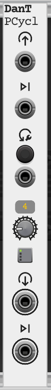

# PCycl

`PCycl` (Poly Cycle) takes a mono signal and routes it to one channel of a polyphonic output. Each trigger moves the
signal to the next channel, and after the last channel it returns to the first. The trigger is passed through on a
second polyphonic output, on the same channel as the signal.

It is intended for sources that are not MIDI. VCV's MIDI to CV module gives each new note its own channel, so the
release of one note can ring on while the next one starts. Patching a mono sequencer's pitch and gate through `PCycl`
gives the same result.

## Controls and Ports

Each icon on the panel sits above the port it describes.

### Signal Input

* **`Signal input`**: The mono signal to be routed, for example the pitch output of a sequencer. If a polyphonic cable
  is connected only its first channel is used.

### Trigger Input

* **`Next channel trigger input`**: A rising edge here moves the signal to the next channel. This would normally be the
  gate that belongs to the signal. The voltage at this input is also passed to the trigger output.

### Reset

* **`Reset` Button** and **`Reset trigger input`**: Returns the signal to the first channel. The next trigger stays on
  the first channel, so the first note after a reset always plays there.

### Channels

* **`Channels` Knob**: Sets the number of channels to cycle through, from `1` to `16`. The number is shown above the
  knob.

* **Grid Light**: Shows which channel is currently receiving the signal.

### Outputs

* **`[Poly] Signal output`**: The routed signal. The channel that is currently selected follows the input. What the
  other channels output is set in the context menu, see `Idle channels` below.

* **`[Poly] Trigger output`**: The trigger input, on the same channel as the signal. The other channels are at `0V`.
  It can instead send a trigger or gate made by the module, see `Advance on signal jump` below.

When the module is bypassed both inputs are passed to their outputs unchanged, as mono signals.

## Context Menu

* **Idle channels**: What the signal output sends on the channels that are not selected.
  * `Hold last value` (default): Each channel keeps the last value it received. Use this for pitch, so that a note
    which is still releasing stays in tune.
  * `Zero volts`: The channels fall to `0V`.

* **Signal delay**: Delays the signal by `0` to `8` samples. See `Timing` below for when this is needed.

* **Advance on signal jump**: When enabled, the signal also moves to the next channel whenever it jumps by the
  threshold or more. With a `V/Oct` signal and the default threshold of one semitone, each different note played on a
  keyboard is given a new channel, including notes played legato where the gate never falls.
  * **Threshold**: The size of jump that counts, from `0.01V` to `2V`. The default is `0.083V`, one semitone.
  * Only jumps count. Slow movement such as a glide, vibrato or pitch bend stays on the same channel.
  * A jump and a trigger that arrive within `1ms` of each other are treated as one note, so patching both does not
    skip a channel.
  * **Trigger output**: What the trigger output sends while this feature is enabled. It is useful when there is no
    gate to patch to the trigger input.
    * `Pass trigger input` (default): The trigger input is passed through, as it is when the feature is disabled.
    * `Off`: The output stays at `0V`.
    * `Trigger for each note`: A `1ms`, `10V` trigger is sent on the new channel each time a note starts.
    * `Gate for each note`: A `10V` gate is sent on the new channel each time a note starts. Its length is set by
      `Gate length`. Gates on different channels overlap. If a channel is used again before its gate has finished,
      the gate drops to `0V` for one sample so that the voice is triggered again.
  * **Gate length**: The length of the gate, from `0.01` to `2` seconds. The default is `0.1` seconds.

## Timing

In VCV Rack every cable delays its signal by one sample. `PCycl` changes channel on the sample that the trigger
arrives, so what happens at a note change depends on whether the signal and its trigger arrive together.

* **Together**: The new value only ever appears on the new channel. This is the normal case when the signal and the
  trigger come straight from the same module, each through one cable.

* **Signal arrives first**: The new value reaches the previous channel before the trigger moves it on. With
  `Hold last value` that channel then keeps the wrong value, so a releasing note would jump to the pitch of the next
  one. This happens when the trigger takes a longer route than the signal, for example through another module. Set
  `Signal delay` to the number of extra cables in the trigger's route to correct it.

* **Trigger arrives first**: The previous channel is not affected. The new channel outputs the old value for the
  samples in between, which is the same as would happen in the patch without `PCycl`.

Enabling `Advance on signal jump` also protects the previous channel when a stepped signal arrives first, because the
jump moves to the new channel before the trigger arrives.

## Patch Example

To play a mono sequencer polyphonically:

1. Patch the sequencer's pitch output to the `Signal input` and its gate output to the `Next channel trigger input`.
2. Set the `Channels` knob to the number of voices wanted.
3. Patch the `[Poly] Signal output` to the `V/Oct` input of a polyphonic oscillator and the `[Poly] Trigger output` to
   the gate input of a polyphonic envelope.

Each step of the sequence now plays on the next voice, and with a long release on the envelope the notes overlap.
